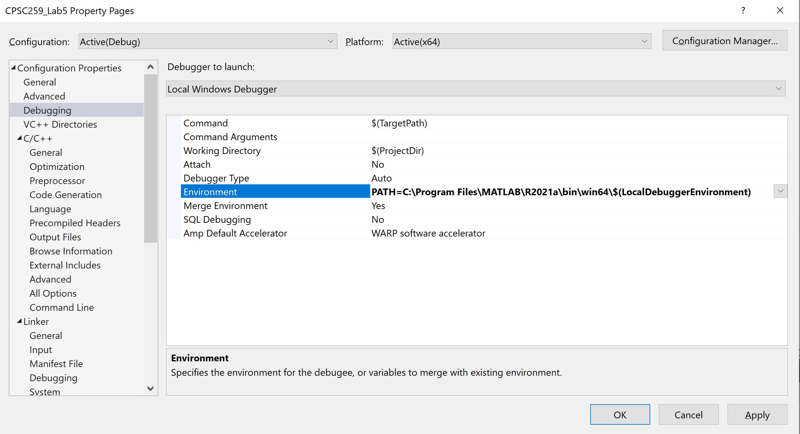
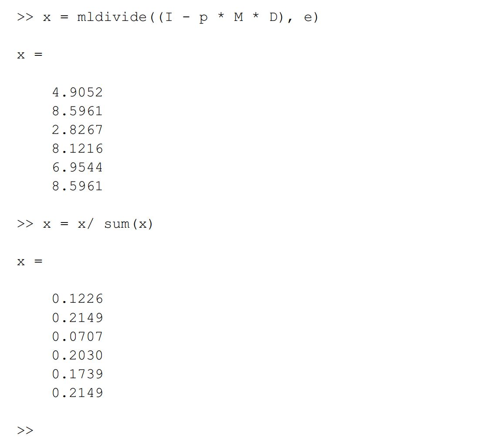
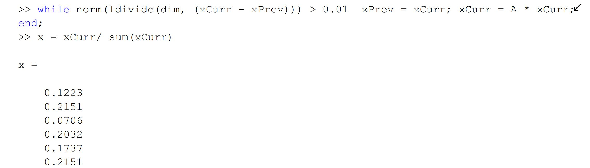
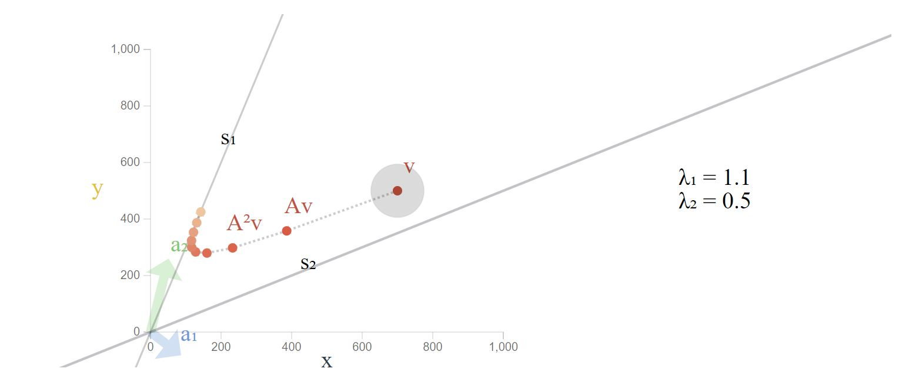
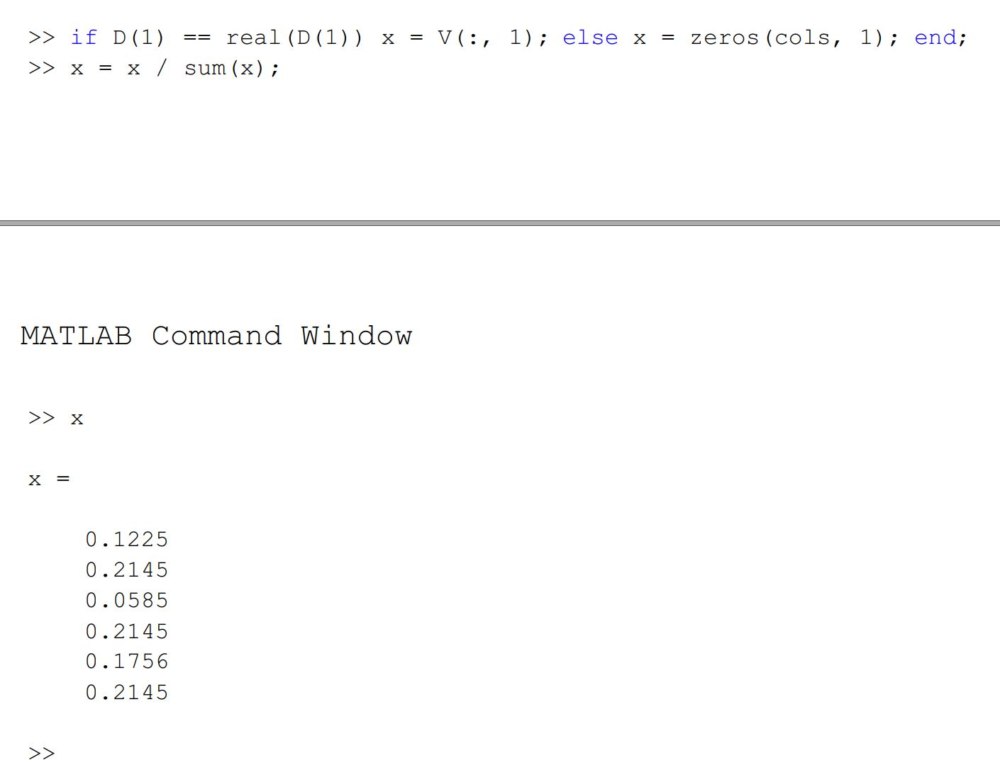

# Google PageRank : MATLAB Engine for C

## Contents

* [Overview](#Overview)
* [Installations](#Installations)
    * [VS-2019](#Visual-Studio-2019)
    * [MATLAB-2021a](#MATLAB-2021a)
    * [Demonstration](#Demonstration)
* [MATLAB Test](#MATLAB_Test)
* [PageRank Algorithm](#PageRank-Algorithm)
    * [Markov Chain](#Markov-Chain)
    * [Connectivity Matrix](#Connectivity-Matrix)
    * [Initial Approximation](#Initial-Approximation)
    * [Power Method](#Power-Method)
        * [Transition Matrix](#Transition-Matrix)
    * [Principal Eigenvector](#Principal-Eigenvector)
* [Credit](#Credit)
    * [Policy](#Policy)

## Overview

I implemented a simplified version of the <b>Google PageRank</b> algorithm. This program was developed using the <a href = "https://www.mathworks.com/help/matlab/calling-matlab-engine-from-c-programs-1.html">**MATLAB Engine API for C**</a>.

A matrix multiplication [project](MATLAB_Test) was built to become familiar with the **MATLAB Engine**.

## Installations

### Visual Studio 2019

The source and header files were written to be compiled and run in the <b>Visual Studio 2019 IDE</b>. The [(`CPSC259_Lab5.sln`)](CPSC259_Lab5.sln) solution file can be opened in the <b>Visual Studio</b> software.

<b>Configuration Properties</b> in the <b>VS Solution Explorer</b> :

<ul>
    <li><b>C/C++->Additional Include Directories</b> :  <i>...\MATLAB\R2021a\extern\include;%(AdditionalIncludeDirectories)</i></li>
    <li><b>Linker->Additional Library Directories</b> :  <i>...\MATLAB\R2021a\extern\lib\win64\microsoft;%(AdditionalLibraryDirectories)</i></li>
    <li><b>Debugging->Environment</b> :  <i>PATH=...\MATLAB\R2021a\bin\win64\$(LocalDebuggerEnvironment)</i></li>
</ul>

    

### MATLAB 2021a

<b>MATLAB 2021a</b> was installed in order to perform matrix calculations in the **MATLAB Engine**. I made use of the <b>MATLAB</b> commands in the [(`pagerank.c`)](PageRank/pagerank.c) source file in order to calculate the <b>PageRank Algorithm</b>. To ensure the intended performance of our **C** program, I also tested the <b>PageRank Algorithm</b> in the <b>MATLAB Command Window</b>.

### Demonstration

A video in the [`Demonstrations`](Demonstrations) directory shows the <b>Power Method</b> calculation when running the program on <b>Visual Studio</b>. I have embedded a low resolution compressed version below.

https://user-images.githubusercontent.com/52113009/135350441-df83eab4-6f10-44e2-b53d-90ce41e05b6e.mp4

## PageRank Algorithm

I have designed a simplified version of <b><a href = "https://en.wikipedia.org/wiki/Google">Google</a></b>'s <b>PageRank Algorithm</b>. This was developed by <b><a href = "https://en.wikipedia.org/wiki/Larry_Page">Larry Page</a></b> as a means of identifying the relevant webpages on the Internet.

### Markov Chain

The <b>PageRank</b> theory is based on the assumption that a hypothetical web surfer randomly clicks on hyperlinks to jump between webpages. This theoretical random walk is referred to as a <b>Markov Chain</b>. I have mathematically accounted for the probability that the random walk will follow the hyperlinks through a variable <i>p</i>. This is pivotal to calculate the <b>PageRank</b> through the <b>Power Method</b> in the **MATLAB Engine**.

### Connectivity Matrix

The connectivity matrix for the <b>PageRank</b> algorithm is parsed from the [(`web.txt`)](PageRank/web.txt) file. The input contains a number of lines of binary values, where outgoing links from webpages are arranged in column-wise fashion.

In Essence : 
    *1* values indicate the presence of an outgoing link from page <i>j</i> to page <i>i</i>. 
    *0* values indicate the absence of an outgoing link from page <i>j</i> to page <i>i</i>. 

I performed the parsing functionality in the [(`websolver.c`)](PageRank/websolver.c) source file.

### Initial Approximation

I calculated the <b>PageRank</b> approximation by running the <b>MATLAB</b> command `x = mldivide((I - p * M * D), e);`.

Considering the <b>MATLAB</b> Variables : 
    `I` represents the identity matrix. 
    `p` represents the probability of following a hyperlink. 
    `M` represents the connectivity matrix. 
    `D` represents the sparse matrix with the probabilities of following an individual link from each webpage. 
    `e` represents a 6x1 ones array, which `mldivide` is called on to left divide the matrix result of `(I - p * M * D)`. 

In mathematical representation, we are solving for the variable <i>x</i> where <i>(I - p * M * D) * x = e</i>.

After normalizing <i>x</i> with the <b>MATLAB</b> command `x = x/ sum(x);`, this yields the <b>PageRank</b> approximation for the probability of a random web surfer accessing each of the webpages.

    

The complete <b>MATLAB</b> output can be view in the [(`Approximation.pdf`)](Figures/Approximation.pdf) file.

### Power Method

In the <b>Power Method</b> I also account for the probability <i>1-p</i> that the web surfer comes across the webpage without accessing a hyperlink. Even though the model is composed of a finite number of webpages, <i>n</i> (i.e. <i>n = 6</i>), this is the practical approach to calculating the <b>PageRank</b> for a very large number of pages (i.e. <i>n >> 6</i>).

### Transition Matrix

This method involves multiplying the <b>PageRank</b> by a <b>Transition Matrix</b>, which is generated through the <b>MATLAB</b> command :

` A = p * M * D + e * (((1 - p) * (colSums ~= 0) + (colSums == 0) )/ dim); `

Considering the <b>MATLAB</b> Variables : 
    `p` represents the probability of following a hyperlink. 
    `M` represents the connectivity matrix. 
    `D` represents the sparse matrix with the probabilities of following an individual link. 
    `e` represents a 6X1 ones array which I use to calculate the probability of randomly choosing a webpage. 
    `colSums` represents the total number of outgoing links from each webpage. 
    `dim` represents the row-size and column-size of the square connectivity matrix. 

The <b>Power Method</b> accounts for the <b>Markov Chain</b> in the calculation by including the probability of choosing a random webpage. This multiplication is performed in an iterative fashion, until the <b>PageRank</b> stops changing. This yields the limiting probability that an infinitely dedicated web surfer accesses a given webpage.

In order to do this, I executed the <b>MATLAB</b> command :

` while norm(ldivide(dim, (xCurr - xPrev))) > 0.01  xPrev = xCurr; xCurr = A * xCurr; end; `

The current and previous <b>PageRank</b> values are compared in order to perform the necessary number of <b>PageRank</b> iterations.

    

The complete <b>MATLAB</b> output can be view in the [(`Power_Method.pdf`)](Figures/Power_Method.pdf) file.

### Principal Eigenvector

Repeatedly multiplying the <b>Transition Matrix</b> by the <b>PageRank</b> can be mathematically represented as :

` A * x = A * A * x = A * A * A * x = lambda * x = x' `

This is the mathematical formula for an eigenvector. From this, I deduced that the <b>PageRank Algorithm</b>, as calculated by the <b>Power Method</b>, represents a system that evolves after every step. The <b>Transition Matrix</b> pulls the <b>PageRank</b> towards the principal eigenvector. This is best viewed in the following visual. This is sourced from the <b><a href = "https://setosa.io/ev/eigenvectors-and-eigenvalues/">Eigenvectors and Eigenvalues</a></b> web post.

    

To evaluate this, I calculated the principal eigenvector in the **MATLAB Engine**, as shown below.

    

The complete <b>MATLAB</b> output can be view in the [(`Principal_Eigenvector.pdf`)](Figures/Principal_Eigenvector.pdf) file.

## Credit

This was originally completed as a final project for <b>CPSC 259 - Data Structures and Algorithms for Electrical Engineers</b>, which is a course at the <b>University of British Columbia</b>. Unlike the other labs for this course, this program was created entirely from scratch.

However, this project was heavily modified to deviate from the original submission and to respect course policies. In its current form, it is largely a personal exploration of the **C** language features as well as the mathematics of the <b>PageRank Algorithm</b>.

The <b>MATLAB</b> commands executed to perform the <b>PageRank</b> calculations were heavily inspired by the <b>CPSC 259</b> course instructions, as well as from the following sources:

<ul>
    <li><b><a href = "https://www.mathworks.com/content/dam/mathworks/mathworks-dot-com/moler/exm/chapters/pagerank.pdf">MATHWORKS PageRank Document</a></b></li>
    <li><b><a href = "https://www.youtube.com/watch?v=J_q2XjWyyGI&ab_channel=SamuliSiltanen">Samuli Siltanen Youtube Demonstration</a></b></li>
</ul>

The mathematical rationality behind eigenvectors powering the <b>PageRank</b> algorithm was further explored from the following sources:

<ul>
    <li><b><a href = "https://www.dhruvonmath.com/2019/03/20/pagerank/">Dhruv On Math PageRank</a></b></li>
    <li><b><a href = "https://setosa.io/ev/eigenvectors-and-eigenvalues/">Eigenvectors and Eigenvalues</a></b></li>
    <li><b><a href = "https://en.wikipedia.org/wiki/PageRank#Simplified_algorithm">PageRank Wikipedia</a></b></li>
</ul>

### Policy

I have read and understood the plagiarism policies at <a href = "http://www.cs.ubc.ca/~tmm/courses/cheat.html">http://www.cs.ubc.ca/~tmm/courses/cheat.html</a> and I understand that no excuse for plagiarism will be accepted.
